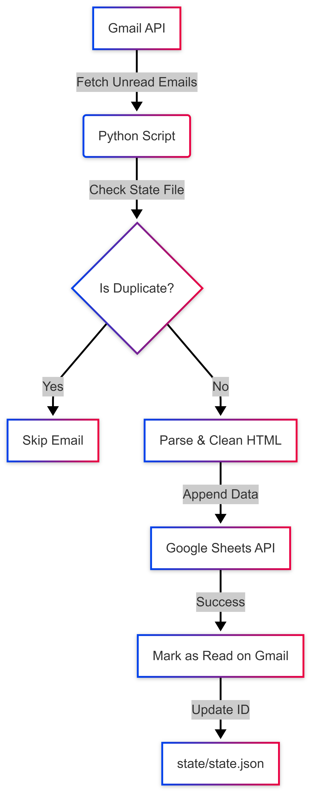
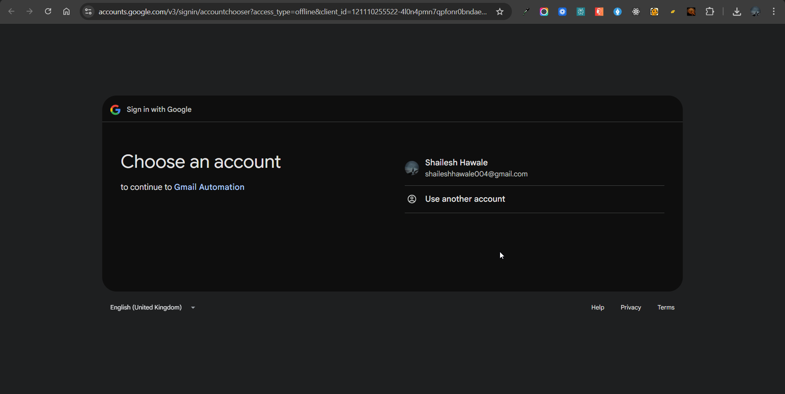
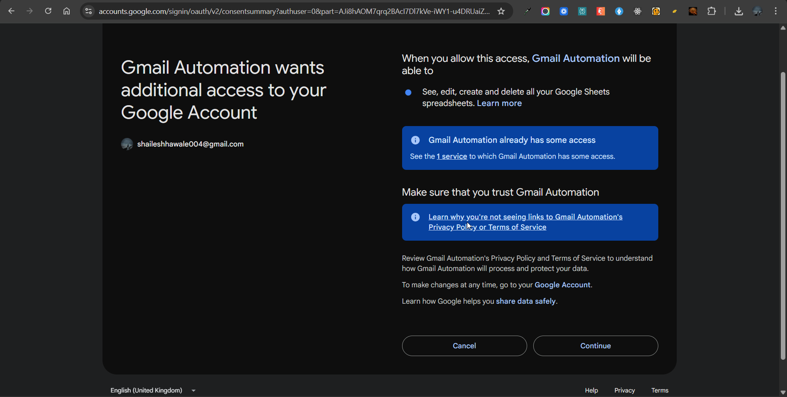
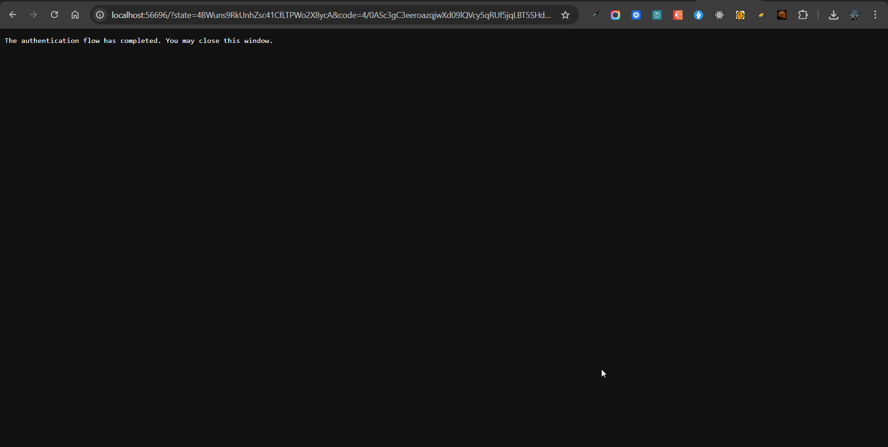
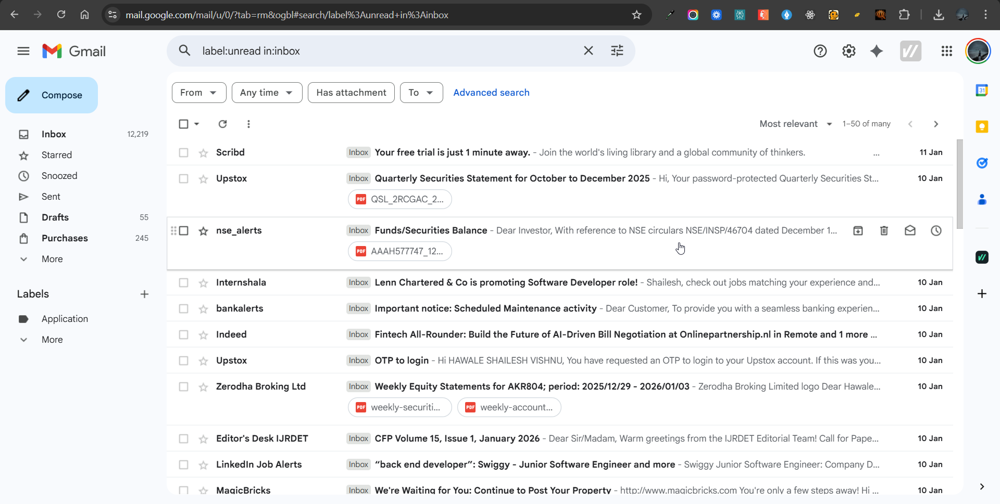
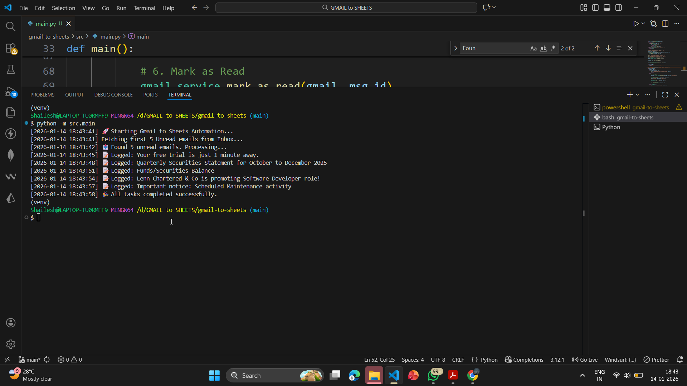
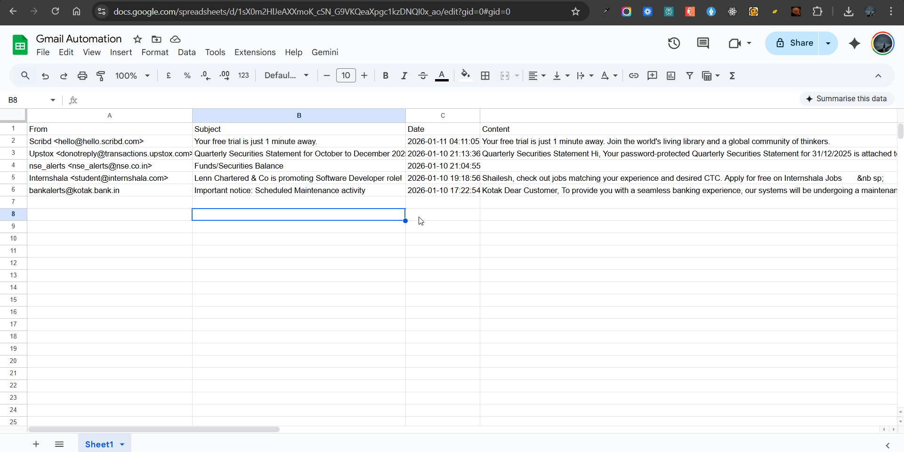

# Gmail to Sheets Automation 

**Author:** Shailesh Hawale  
**Submission Date:** 15-01-2026  

## 📖 Project Overview
This Python automation system connects the **Gmail API** with the **Google Sheets API**. It fetches real-time unread emails from a Gmail inbox, parses the relevant data (Sender, Subject, Date, Body), and logs them into a Google Sheet.

The system is designed with **idempotency** in mind, ensuring that no email is duplicated and state is preserved across multiple runs.

---

## 🏗️ High-Level Architecture

The system follows a linear ETL (Extract, Transform, Load) pipeline:



## 📸 Proof of Execution

### 1. OAuth Authentication Flow
**Goal:** Secure user login via Google OAuth 2.0.
<div style="display: flex; gap: 10px;">
  
  
  
</div>

### 2. Gmail Inbox
**Goal:** Reading unread emails before processing.



### 3. Terminal Output
**Goal:** Showing execution logs with timestamps (Bonus Feature).



### 4. Google Sheets Output
**Goal:** Successfully appended email data to the sheet.




## ⚙️ Setup & Installation

### Prerequisites
```bash 
Python 3.8+
```

Google Cloud Console Project with Gmail API and Google Sheets API enabled.

### 1. Clone the Repository

```bash 
git clone https://github.com/HawaleShailesh004/Gmail-to-Sheets.git
cd gmail-to-sheets
```

### 2. Install Dependencies
```bash 
pip install -r requirements.txt
```
### 3. Configure Credentials
Place your OAuth 2.0 

```bash 
credentials.json file in the credentials/ folder.
Open config.py and update the SPREADSHEET_ID with your Google Sheet ID.
```

### 4. Run the Automation
```bash
python -m src.main
```

## Design Decisions & Logic
### 1. OAuth 2.0 Authentication
Flow Used: InstalledAppFlow (Desktop Client).

Reason: This is a user-facing script running locally. Service Accounts were avoided as per assignment requirements to ensure the script acts on behalf of the user, not a bot.

Scopes:

gmail.modify: To read emails and remove the UNREAD label.

sheets: To write data to the spreadsheet.

### 2. State Persistence & Duplicate Prevention
I implemented a Dual-Layer State System to ensure robustness:

Layer 1 (Server-Side): The script queries Gmail strictly for q='is:unread'. Once processed, the script removes the UNREAD label via the API.

Layer 2 (Local-Side): A local JSON file (state/state.json) stores the unique Message-ID of every processed email.

Why? If the script crashes after writing to Sheets but before marking as read, the email remains "Unread" on Gmail. Without this local check, the next run would create a duplicate row. This file acts as a safety net.

## 🛠️ Challenges Faced & Solutions
### Challenge: "Ugly" Formatting in Google Sheets

**Problem:**  
Raw email bodies contain excessive newlines (\n), HTML tags, and carriage returns. When pasted into Sheets, this caused single rows to expand vertically, making the sheet unreadable.

**Solution:**  
I implemented a cleaning logic in email_parser.py using BeautifulSoup to strip HTML, followed by a .split() and .join() operation. This "flattens" the text into a single, clean line while preserving the content.

### ⭐ Bonus Features Implemented
**HTML → Plain Text Conversion:** Uses BeautifulSoup to intelligently extract text from HTML-only emails.

**Logging with Timestamps:** All console output includes precise timestamps (e.g., [2026-01-14 18:30:05]) for better debugging and audit trails.

### ⚠️ Limitations
Attachments: The current version ignores attachments.

**API Quotas:** Heavy usage relies on standard Google API quotas; extremely high volume might require batching requests (though not an issue for this assignment scope).

## 📂 Project Structure
Plaintext

```
gmail-to-sheets/
│
├── src/
│ ├── main.py            # Entry point & State orchestration
│ ├── gmail_service.py   # Gmail API interactions
│ ├── sheets_service.py  # Sheets API interactions
│ └── email_parser.py    # logic to clean data
│
├── credentials/         # (Ignored by Git)
├── state/               # Stores state.json
├── .gitignore
├── requirements.txt
└── README.md
```
---
